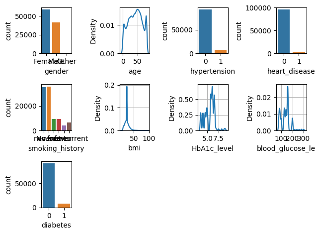
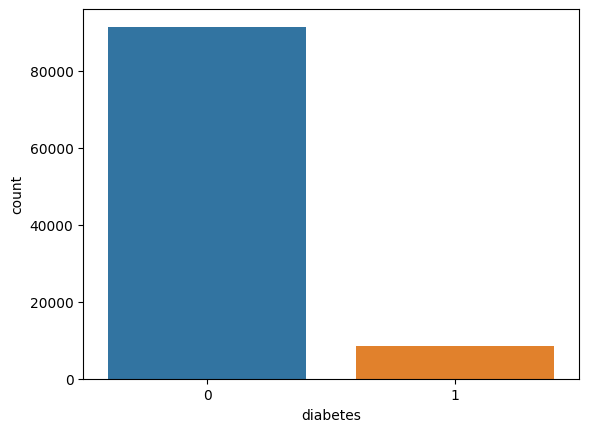
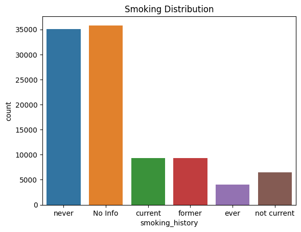
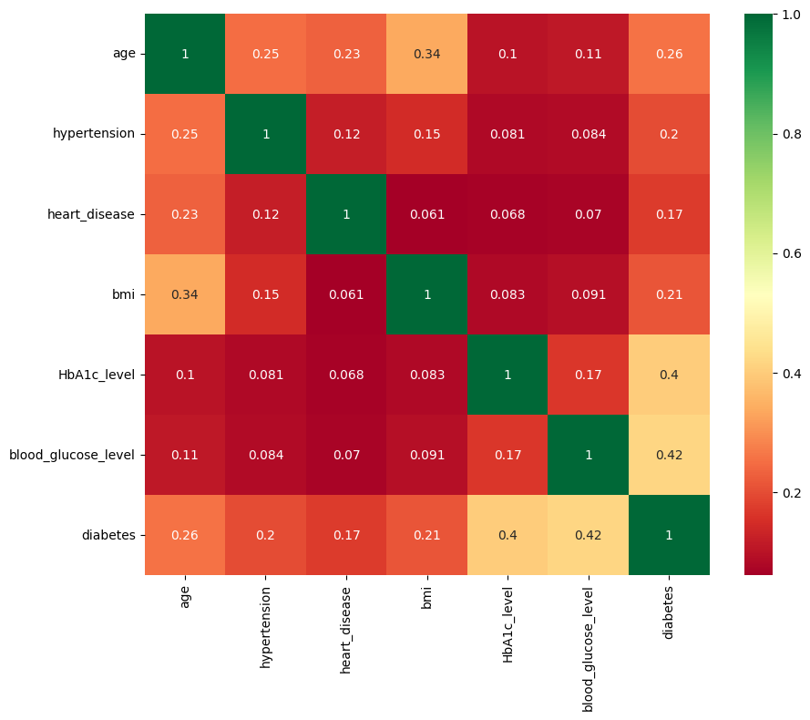
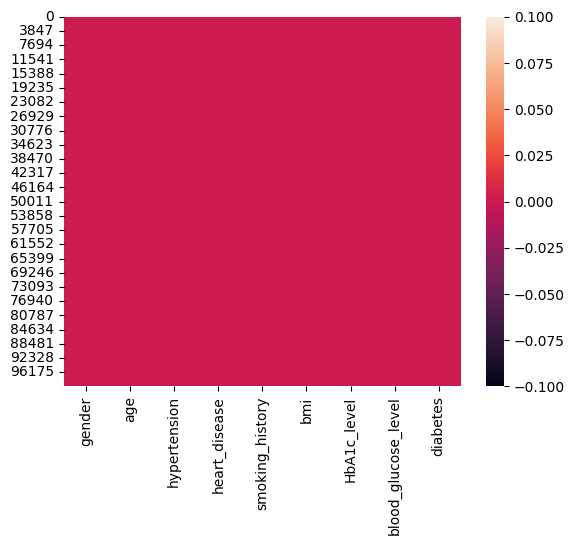
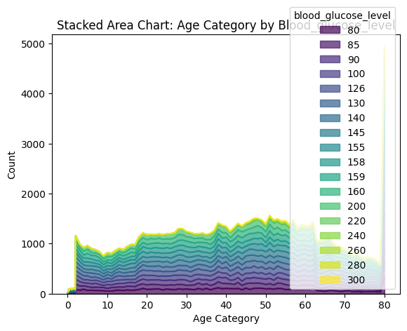
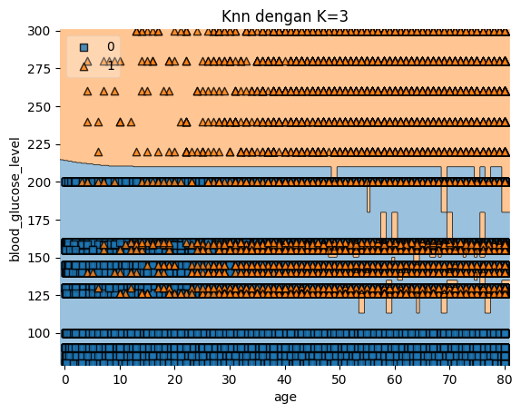
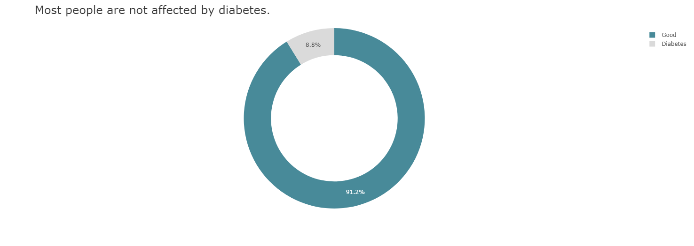
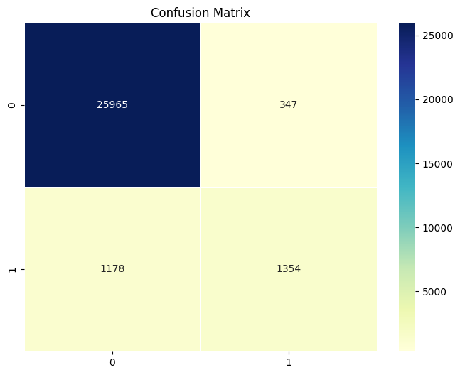

# Laporan Proyek Machine Learning
### Nama : Syams Muhammad Haryanto
### Nim : 211351144
### Kelas : Pagi B

## Domain Proyek

Web App yang saya kembangkan ini sebaiknya digunakan oleh/berdampingan dengan seorang profesional agar variabel-variabel yang diinputkan tidak semena-mena dimasukkan begitu saja, Web App ini dikembangkan untuk memudahkan pengguna dalam menentukan proses pengobatan selanjutnya tergantung dari hasil output Web App ini. Namun jika anda bukanlah seorang profesional sebaiknya mendatangi langsung ahlinya.

## Business Understanding

Memungkinkan seorang profesional/dokter bekerja lebih cepat dan tepat, dengan itu lebih banyak pasien akan mendapatkan penanganan langsung dari seorang dokter.

### Problem Statements

Semakin banyaknya orang yang didiagnosa mengidap diabetes dikarenakan pola hidup modern yang tidak teratur/buruk, maka semakin banyak pula pasien yang harus ditangani oleh ahli profesional.

### Goals

Memudahkan dokter/ahli profesional dalam menentukan pengobatan selanjutnya bagi pasien yang mengidap/tidak mengidap penyakit diabetes dengan hasil yang dikeluarkan oleh Web App.

### Solution Statements

Membuat web app yang bisa memudahkan dan mempercepat proses pemeriksaan yang dilakukan oleh sang ahli pada pasiennya.

## Data Understanding
Diabetes prediction dataset adalah datasets yang saya gunakan, saya dapatkan dari website [kaggle](https://www.kaggle.com/) . Data-data yang terdapat di dalam datasets ini didapatkan dari data medikal pasien (tentunya dikumpulkan dengan izin mereka) alias data riil. Datasets ini mengandung 9 Attribut(Kolom) dan 100,000 data(baris) pada saat sebelum pemrosesan data cleasing dan EDA.<br> 

[Diabetes prediction dataset](https://www.kaggle.com/datasets/iammustafatz/diabetes-prediction-dataset).

### Variabel-variabel pada Heart Failure Prediction Dataset adalah sebagai berikut:
- gender : merupakan jenis kelamin pasien. [Female, Male]
- age : merupakan umut pasien. [Numbers, min: 0, max: 80]
- hypertension : merupakan kondisi medis yang dialami oleh pasien dimana tekanan darah semakin meningkat. [1: True, 0: False]
- heart_disease: merupakan kondisi medis yang dialami oleh pasien dimana mereka memiliki penyakit jantung. [1: True, 0: False]
- smoking_history : menunjukkan mengenai riwayat merokok pasien. [No info, never, former, current, not current]
- bmi : merupakan pengukuran lemak tubuh berdasarkan berat dan tinggi badan [Float, min: 10, max: 95.7]
- HbA1c_level : merupakan pengukuran rata-rata level gula pada darah dari 2-3 bulan yang lalu.[Float, min: 3.5, max: 9]
- blood_glucose_level : merupakan pengukuran rata-rata level gula pada darah dari 1-3 hari yang lalu.[Numbers, min: 80, max: 300]
- diabetes : menunjukkan apakah pasien mengidap diabetes atau tidak. [1: True, 0: False]

## Data Preparation
### Import Dataset
Langkah pertama yang harus dilakukan adalah mengunduh datasetsnya. Berikut caranya.
``` bash
from google.colab import files
files.upload()
```

Lalu kita harus membuat folder untuk menampung file kaggle yang tadi telah diupload,
``` bash
!mkdir -p ~/.kaggle
!cp kaggle.json ~/.kaggle/
!chmod 600 ~/.kaggle/kaggle.json
!ls ~/.kaggle
```

Lalu, download datasets menggunakan code dibawah ini,
``` bash
!kaggle datasets download -d iammustafatz/diabetes-prediction-dataset
```

Setelah download telah selesai, langkah selanjutnya adalah mengektrak file zipnya kedalam sebuah folder,
``` bash
!mkdir diabetes-prediction-dataset
!unzip diabetes-prediction-dataset.zip -d diabetes-prediction-dataset
!ls diabetes-prediction-dataset
```
Datasets telah diekstrak, seharusnya sekarang ada folder yang bernama diabetes_prediction dan di dalamnya terdapat file dengan ektensi .csv,

### Import Library
Langkah selanjutnya adalah mengimport library yang dibutuhkan untuk melaksanakan data Exploration, data visualisation, data cleansing, dll
``` bash
import pandas as pd
import numpy as np
import matplotlib.pyplot as plt
import seaborn as sns
import plotly.express as px
import pickle
from sklearn.model_selection import train_test_split
from sklearn.neighbors import KNeighborsClassifier
from sklearn.metrics import accuracy_score, classification_report, confusion_matrix
from sklearn import datasets, neighbors
from mlxtend.plotting import plot_decision_regions
```

### Data Discovery
Langkah pertama pada tahap ini adalah membaca datasets yang tadi telah diextract.
``` bash
df = pd.read_csv('diabetes-prediction-dataset/diabetes_prediction_dataset.csv')
```

Melihat 5 data pertama pada datasets.
``` bash
df.head()
```

Lalu untuk melihat jumah data, mean data, data terkecil dan data terbesar bisa dengan kode ini,
``` bash
df.describe()
```

Untuk melihat typedata yang digunakan oleh masing-masing kolom bisa menggunakan kode ini,
``` bash
df.info()
```

Disini kita melihat apakah terdapat nilai null/NaN pada datasetsnya.
``` bash
df.isnull().sum()
```

Untuk melihat jumlah nilai unique pada kolom-kolom dataset bisa menggunakan kode ini,
``` bash
df.nunique()
```

Untuk mengecek apakah datasetnya memiliki nilai duplicate bisa menggunakan kode ini,
``` bash
df.duplicated().sum()
```
Terdapat keterangan bahwa 3854 baris merupakan data duplikasi.

Untuk menghitung korelasi antara kolom 'diabetes' dengan kolom-kolom lainnya bisa menggunakan kode ini,
``` bash
correlation = df.corr()
correlation['diabetes'].sort_values(ascending=False)
```

### EDA
Langkah pertama pada tahap ini adalah menampilkan setiap kolom dalam bentuk subplot.
``` bash
r=3
c=4
it=1
for i in df.columns:
    plt.subplot(r,c,it)
    if df[i].nunique()>6:
        sns.kdeplot(df[i])
        plt.grid()
    else:
        sns.countplot(x=df[i])
    it+=1
plt.tight_layout()
plt.show()
```


Lalu, kita akan melihat jumlah orang yang memiliki penyakit diabetes dan yang tidak memiliki penyakit diabetes.
``` bash
sns.countplot(data=df, x='diabetes')
```
<br>
Data diabetes(hasil) cenderung menunjukkan hasil 0 atau tidak memiliki diabetes, yang mana itu tidak balance.

Lalu, kita akan melihat jumlah kemunculan setiap kategori dalam kolom 'smoking_history' secara visual.
``` bash
sns.countplot(x='smoking_history', data=df)
plt.title('Smoking Distribution')
plt.show()
```


Selanjutnya kita akan melihat korelasi antar kolomnya,
``` bash
plt.figure(figsize=(10,8))
sns.heatmap(df.corr(), annot=True, cmap ='RdYlGn')
```
<br>
Korelasi antar kolom numerik terlihat aman namun saya merasa terlalu banyak data yang tidak berkaitan erat.

Selanjutnya melihat apakah di dalam datasetsnya terdapat nilai null,
``` bash
sns.heatmap(df.isnull())
```
<br>
Semuanya merah yang menandakan bahwa datasetsnya tidak memiliki data null di dalamnya.

### Preprocessing
Untuk menghapus data duplikasinya bisa menggunakan kode berikut.
``` bash
df.drop_duplicates(inplace=True)
```

Lalu, kita hapus kolom 'gender' karena kolom tersebut tidak diperlukan dalam analisis atau pemodelan.
``` bash
df.drop("gender",axis=1,inplace=True)
df.head()
```

Untuk menyeimbangkan data berdasarkan kolom 'diabetes' bisa menggunakan kode ini.
``` bash
def unbalance_data(df):
    df_pos = df.query("diabetes == 1")
    df_neg = df.query("diabetes == 0").sample(len(df_pos))
    return df_pos, df_neg


df_pos, df_neg = unbalance_data(df)
df_pos.shape, df_neg.shape
```

Selanjutnya membuat fungsi untuk menjadikan masing-masing string menjadi sebuah integer,
``` bash
def change_string_to_int(column):
    variables=pd.unique(df[column])
    for item in range(variables.size):
        df[column]=[item if each==variables[item] else each for each in df[column]]
    return df[column]
```

Lalu mengimplementasikan fungsi yang tadi sudah dibuat dan memasukkan hasilnya pada kolom yang sesuai dan menampilkan 5 data pertama pada datasets,
``` bash
df["smoking_history"]=change_string_to_int("smoking_history")
df.head()
```

Selanjutnya kita lakukan seleksi fitur dengan memisahkan mana saja atribut yang akan dijadikan sebagai fitur dan atribut mana yang dijadikan label,
``` bash
features = ['age','hypertension','heart_disease','smoking_history','bmi','HbA1c_level','blood_glucose_level']
x = df[features]
y = df['diabetes']
x.shape, y.shape
```

Lalu memisahkan data training dan data testing,
``` bash
x_train, x_test, y_train, y_test = train_test_split(x,y,test_size=0.3)
print(x.shape, x_train.shape, x_test.shape)
```

### Modeling
Model machine learning yang akan digunakan disini adalah KNN, langkah pertama yang harus kita selanjutnya adalah mengimplementasikan model KNN dan melihat tingkat akurasinya,
``` bash
knn = KNeighborsClassifier(n_neighbors=3)
knn.fit(x_train, y_train)
y_pred = knn.predict(x_test)
score = knn.score(x_test, y_test)

print(f"Accuracy Score: {score}")
print(classification_rep)
```
Score yang kita dapatkan disini adalah 94%

Lalu kita akan uji dengan data inputan kita sendiri,
``` bash
input_data = np.array([[80.0,0,1,0,25.19,6.6,140]])

prediction = knn.predict(input_data)
print(prediction)
if prediction == [0]:
  print('Tidak Terkena Penyakit Diabetes')
elif prediction == [1]:
  print('Terkena Penyakit Diabetes')
```
Hasilnya adalah 0(Tidak Terkena Penyakit Diabetes).

### Visualisasi Hasil Algoritma
Langkah pertama pada tahap ini adalah membuat stacked area chart yang menunjukkan hubungan antara kolom 'age' dan 'blood_glucose_level'.
``` bash
crosstab = pd.crosstab(df['age'],df['blood_glucose_level'])
crosstab.plot(kind='area', colormap='viridis', alpha=0.7, stacked=True)
plt.title('Stacked Area Chart: Age Category by Blood_glucose_level')
plt.xlabel('Age Category')
plt.ylabel('Count')
plt.show()
```


``` bash
def knn_comparison(df, k):
 x = df[['age','blood_glucose_level']].values
 y = df['diabetes'].astype(int).values
 clf = neighbors.KNeighborsClassifier(n_neighbors=k)
 clf.fit(x, y)

# Plotting decision region
 plot_decision_regions(x, y, clf=clf, legend=2)

# Adding axes annotations
 plt.xlabel('age')
 plt.ylabel('blood_glucose_level')
 plt.title('Knn dengan K='+ str(k))
 plt.show()

 knn_comparison(df, 3)
```

Diatas merupakan visualisasi knn antara age dengan blood_glucose_level.

Selanjutnya menampilkan diagram lingkaran interaktif yang memvisualisasikan distribusi frekuensi dari kolom 'diabetes', dengan dua sektor berlabel 'Good' dan 'Diabetes'. Warna sektor dan persentase ditampilkan di dalam sektor-sektor diagram lingkaran.
``` bash
outcome_freq = df['diabetes'].value_counts()
outcome_freq.index = ['Good', 'Diabetes']  # replace 0 and 1 with text labels
colors = ['#488A99', '#DADADA']
fig = px.pie(outcome_freq, values=outcome_freq.values, names=outcome_freq.index,
             hole=0.7, color=outcome_freq.index, color_discrete_sequence=colors)
fig.update_layout(title='Most people are not affected by diabetes.',
                  plot_bgcolor='#FFFFFF',
                  paper_bgcolor='#FFFFFF',
                  font_color='#333333',
                  title_font_size=24)
fig.update_traces(texttemplate='%{percent:.1%}', textposition='inside')
fig.show()
```


## Evaluation
Untuk tahap evaluasi saya menggunakan confusion matrix dan precision, recall dan f1-score untuk menguji modelnya. Ini sangat cocok untuk kasus-kasus yang membutuhkan validasi dalam pengklasifikasiannya. Kodenya sebagai berikut :
``` bash
classification_rep = classification_report(y_test, y_pred)
print("Classification Report:")
```

Selanjutnya kita membandingkan nilai aktual dengan nilai prediksi, kita bisa melihat jumlah hasil prediksi saat model memprediksi diabetes dan nilai aktual pun diabetes, serta melihat saat model memprediksi diabetes sedangkan data aktualnya tidak diabetes dengan menggunakan confusion matrix.
``` bash
print(confusion_matrix(y_test, y_pred))

plt.figure(figsize=(8, 6))
sns.heatmap(confusion_matrix(y_test, y_pred), annot=True, cmap='YlGnBu', fmt='g', linewidths=.5)
plt.title('Confusion Matrix')
plt.show()
```

Disitu terlihat jelas bahwa model kita berhasil memprediksi nilai diabetes yang sama dengan nilai aktualnya sebanyak 25988 data.

## Deployment
pada bagian ini anda memberikan link project yang diupload melalui streamlit share. boleh ditambahkan screen shoot halaman webnya.


